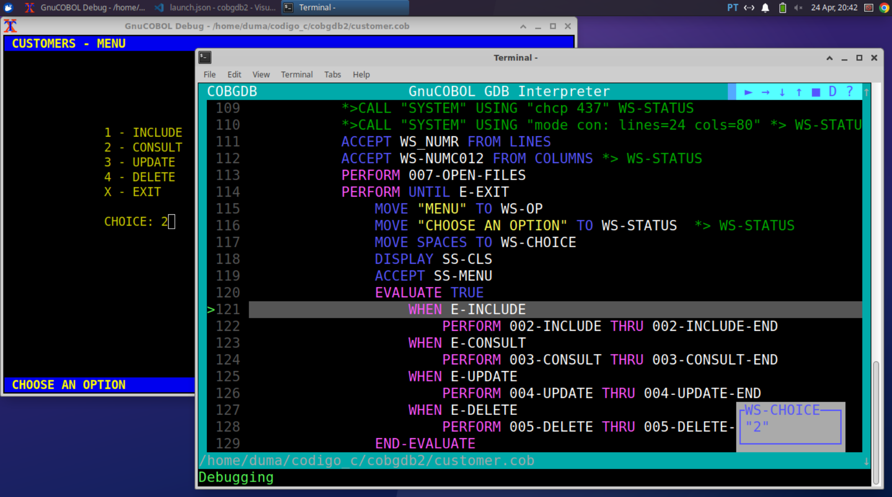

<h1>COBGDB</h1>

It is a command-line application, programmed in C, designed to assist in debugging GnuCOBOL code using GDB. The application is based on the extension for Visual Studio Code (VSCode) created by Oleg Kunitsyn, which can be found on GitHub: https://github.com/OlegKunitsyn/gnucobol-debug. 

CDBGDB is still under development; however, it can already be used and can help you debug your applications.

## Requirements

* GnuCOBOL cobc 3.1.2 or later.
* GNU Compiler gcc.
* GNU Debugger gdb.

## Getting Started

In the Windows subdirectory, the executable program for this operating system is available.

To compile the code on Windows, you can use MinGW, which is usually included in the GnuCOBOL package. The Makefile is configured to generate the program for both Windows and Linux.

To run the example program:

1. On Windows, first install MinGW (Minimalist GNU for Windows) or use the gcc/mingw32-make included in the GnuCOBOL package.
2. Execute the make ('mingw32-make' for Windows) command to compile the code.
3. Run the example program using the following command:
```bash
cobgdb customer.cob -lpdcurses
```
   
In the example above, '-lpdcurses' is an instance of an argument that can be indirectly passed to 'cobc' by 'cobgdb,' even if it is not used by 'cobgdb' itself.


COBGDB takes one or more programs with COB/CBL extension as parameters and runs the GnuCOBOL compiler with the following format:
```bash

cobc -g -fsource-location -ftraceall -v -O0 -x prog.cob prog2.cob ...
```

On Linux, it is recommended to use Xterm to view the application.

In the ```doc``` directory of the project, there is a document available that shows the detailed usage of COBGDB, a contribution from Prof. ```Eugenio Di Lorenzo```.

COBGDB running:


Debugging application output:


To debug multiple programs, use COBGDB with the following syntax:

```bash
cobgdb prog.cob subprog1.cob subprog2.cob
```

You can run GDB/GDBSERVER remotely using the `A` key. COBGDD will prompt you to provide the server and port in the format `server:port` or the PID of the application.

Example:

- `localhost:5555`
- `9112`


## COBGDB Debugging a Pre-compiled File

You can also use COBGDB to debug a previously generated executable file. To do this, you must compile the program with these options:
```bash

cobc -g -fsource-location -ftraceall -v -O0 -x prog.cob prog2.cob ...
```

To start debugging, run cobgdb using the ```--exe``` directive as follows:

Windows:
```bash

cobgdb --exe prog.exe
```

Linux:
```bash

cobgdb --exe prog
```

## Main Commands

- `B` - Breakpoint: toggles the breakpoint at the current selected line (can also be done with the mouse).
- `R` - Run: runs the program from the first statement until a breakpoint is encountered.
- `C` - Cursor or Continue: runs the program until it reaches the selected line.
- `J` - Jump: runs the program until it reaches the specified line.
- `N` - Next: runs the program until the next line but does not enter a subroutine executed by CALL or PERFORM.
- `S` - Step: runs the program until the next line.
- `G` - GO: continues the program execution until it encounters a stopping point: breakpoint, end of the program, or the return from a subroutine - PERFORM/CALL.
- `V` - Variables: displays the set of variables for the running program.
- `H` - Show: shows the values of variables for the selected line (right-click also functions).
- `D` - Display of variables: set the automatic display during debugging/animation ON or OFF (default is OFF).
- `F` - File: allows selecting the source file for debugging.
- `A` - Attach: attach to GDBSERVER or Application PID.
- `W` - Window Size: switches between window sizes: 80x24 and 132x34.
- `Q` - Quit: quits the program.

## Linux

Debugging application on Linux:



## Extra Information

The command ```cobgdb --version``` will display the application's version.

This program utilizes the GPLv3+ license (GNU General Public License version 3 or later).

COBGDB has been tested with versions 3.1.2 and 3.2 of GnuCOBOL; however, it should also work with older versions. 

In terms of Linux, it has been tested on GNOME, XFCE and XTerm terminals.

