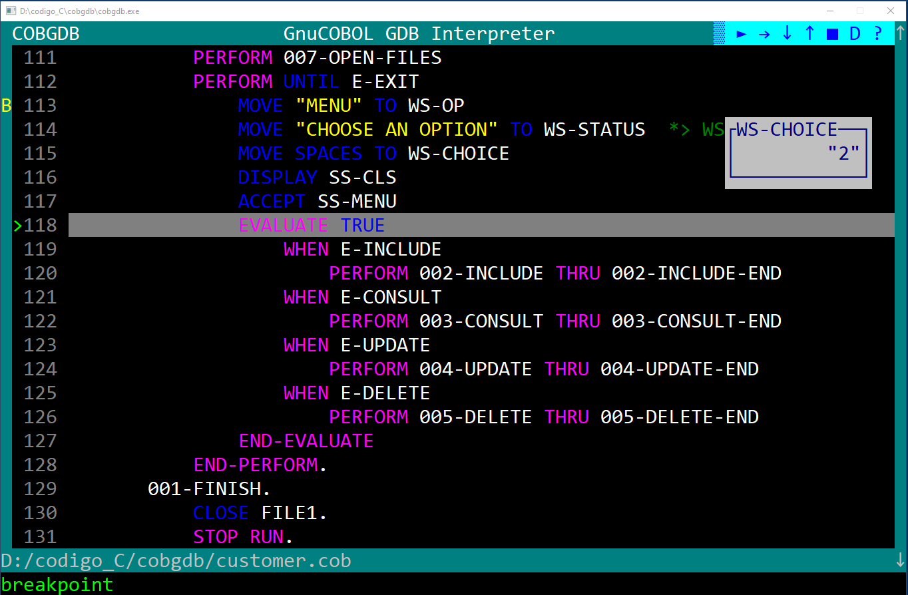

<h1>COBGDB</h1>

It is a command-line application, programmed in C, designed to assist in debugging GnuCOBOL code using GDB. The application is based on the extension for Visual Studio Code (VSCode) created by Oleg Kunitsyn, which can be found on GitHub: https://github.com/OlegKunitsyn/gnucobol-debug. COBGDB is currently in development.

To compile the code on Windows, you can use MinGW. The Makefile is configured to generate the program for both Windows and Linux.

To run the example program:

1. On Windows, first install MinGW (Minimalist GNU for Windows).
2. Execute the 'mingw32-make' command to compile the code.
3. Run the example program using the following command:
   `cobgdb customer.cob -lpdcurses`
   
In the example above, '-lpdcurses' is an instance of an argument that can be indirectly passed to 'cobc' by 'cobgdb,' even if it is not used by 'cobgdb' itself.

On Linux, it is recommended to use Xterm to view the application.

COBGDB running:

Debugging application output:

